# Tarea Git - Github - Markdown - Visual Studio Code
> Crea un repositorio PRIVADO en Github con la documentación de esta práctica. Añade la profesor
como colaborador de ese repositorio. Redacta la práctica usando Markdown, aporta trozos de código
con los comandos **git** y capturas de pantalla.
# 1.- GIT
## 1.1.- Instalación y configuración inicial. (config)
> Para trabajar en Windows con git utilizaremos la terminal: **git bash**.

Instala o comprueba que ya esté instalado el servicio: **git**.
>Utiliza --version para mostrar la versión.

>Utiliza el comando **which git** para saber la ubicación del ejecutable.

Muestra el archivo de configuración global de git.

>El archivo de configuración global de git, si está creado, se encuentra en: **~/.gitconfig**.


Configura de forma global los datos de usuario: nombre y correo electrónico.

Muestra el listado de las distintas opciones de configuración.

Vuelve a mostrar el archivo de configuración global.

```bash
Kevin@DESKTOP-TIUU4RP MINGW64 ~
$ git --version
git version 2.39.1.windows.1

Kevin@DESKTOP-TIUU4RP MINGW64 ~
$ which git
/mingw64/bin/git

Kevin@DESKTOP-TIUU4RP MINGW64 ~
$ cat ~/.gitconfig
[user]
        name = Kevin
        email = kevnmm96@gmail.com

Kevin@DESKTOP-TIUU4RP MINGW64 ~
$ git config --global user.name "Kevin"

Kevin@DESKTOP-TIUU4RP MINGW64 ~
$ git config --global user.email "kevnmm96@gmail.com"

Kevin@DESKTOP-TIUU4RP MINGW64 ~
$ git config --list
diff.astextplain.textconv=astextplain
filter.lfs.clean=git-lfs clean -- %f
filter.lfs.smudge=git-lfs smudge -- %f
filter.lfs.process=git-lfs filter-process
filter.lfs.required=true
http.sslbackend=openssl
http.sslcainfo=C:/Program Files/Git/mingw64/ssl/certs/ca-bundle.crt
core.autocrlf=true
core.fscache=true
core.symlinks=false
pull.rebase=false
credential.helper=manager
credential.https://dev.azure.com.usehttppath=true
init.defaultbranch=master
user.name=Kevin
user.email=kevnmm96@gmail.com

Kevin@DESKTOP-TIUU4RP MINGW64 ~
$ cat ~/.gitconfig
[user]
        name = Kevin
        email = kevnmm96@gmail.com
```

## 1.2.- Crear repositorios locales (init, status, add, commit, log)
Vamos a crear un repositorio llamado despliegue-demo. Crea una carpeta con el mismo nombre que el
repositorio y accede a ella.

Inicia un repositorio.

>Recuerda usar **git status** y **git log --oneline** para ir comprobando el estado de git y los registros de commit.

Muestra el estado de git antes de nada.

Muestra también los registros de commit antes de realizar cambios. Como aún no has hecho ningún
commit, debe darte un error.

```bash
Kevin@DESKTOP-TIUU4RP MINGW64 ~/DESKTOP/DESPLIEGUE
$ mkdir despliegue-demo

Kevin@DESKTOP-TIUU4RP MINGW64 ~/DESKTOP/DESPLIEGUE
$ cd despliegue-demo/

Kevin@DESKTOP-TIUU4RP MINGW64 ~/DESKTOP/DESPLIEGUE/despliegue-demo
$ git init
Initialized empty Git repository in C:/Users/Kevin/Desktop/DESPLIEGUE/despliegue-demo/.git/

Kevin@DESKTOP-TIUU4RP MINGW64 ~/DESKTOP/DESPLIEGUE/despliegue-demo (master)
$ git status
On branch master

No commits yet

nothing to commit (create/copy files and use "git add" to track)

Kevin@DESKTOP-TIUU4RP MINGW64 ~/DESKTOP/DESPLIEGUE/despliegue-demo (master)
$ git log --oneline
fatal: your current branch 'master' does not have any commits yet
```

Crea desde la línea de comandos un archivo **README.md** que contenga el nombre del repositorio.

>Puedes crear un archivo desde terminal con el comando **echo 'Contenido del archivo' >
archivo.md**. Si lo que quieres es un archivo vacío puedes usar el comando **touch archivo.md** y
después con **nano** darle contenido.

Vuelve a mostrar el estado de git después de crear un archivo.

Añade el archivo recién creado al área de intercambio o **staged**.

Vuelve a mostrar el estado de git después de añadir un archivo al **staged**.
```bash
Kevin@DESKTOP-TIUU4RP MINGW64 ~/DESKTOP/DESPLIEGUE/despliegue-demo (master)
$ echo 'despliegue-demo' > README.md

Kevin@DESKTOP-TIUU4RP MINGW64 ~/DESKTOP/DESPLIEGUE/despliegue-demo (master)
$ git status
On branch master

No commits yet

Untracked files:
  (use "git add <file>..." to include in what will be committed)
        README.md

nothing added to commit but untracked files present (use "git add" to track)

Kevin@DESKTOP-TIUU4RP MINGW64 ~/DESKTOP/DESPLIEGUE/despliegue-demo (master)
$ git add README.md
warning: in the working copy of 'README.md', LF will be replaced by CRLF the next time Git touches it

Kevin@DESKTOP-TIUU4RP MINGW64 ~/DESKTOP/DESPLIEGUE/despliegue-demo (master)
$ git status
On branch master

No commits yet

Changes to be committed:
  (use "git rm --cached <file>..." to unstage)
        new file:   README.md

```

Añade los archivos del área de intercambio al repositorio local con **commit**.

>Recuerda poner un mensaje al realizar el commit, con **-m "mensaje"**.

Vuelve a mostrar el estado de git después de añadir un archivo al **commit**.

Muestra los registros de commit después de realizar este primer commit.
```bash
Kevin@DESKTOP-TIUU4RP MINGW64 ~/DESKTOP/DESPLIEGUE/despliegue-demo (master)
$ git commit -m "Creo README"
[master (root-commit) 626c594] Creo README
 1 file changed, 1 insertion(+)
 create mode 100644 README.md

Kevin@DESKTOP-TIUU4RP MINGW64 ~/DESKTOP/DESPLIEGUE/despliegue-demo (master)
$ git status
On branch master
nothing to commit, working tree clean

Kevin@DESKTOP-TIUU4RP MINGW64 ~/DESKTOP/DESPLIEGUE/despliegue-demo (master)
$ git log --oneline
626c594 (HEAD -> master) Creo README
```

>Existe un comando git para a modificar el último commit. Este comando elimina el último commit y
crea otro nuevo con los cambios actuales del **staged**. El comando es **git commit --amend -m
"mensaje"**.

## 1.3.- Deshacer cambios en repositorios locales
### 1.3.1.- Cambios en un archivo que ya se ha incluido en algún commit. (diff, restore)
>Recuerda usar **git diff**, **git diff HEAD** o **git diff --cached**/ **git diff --staged** para ir viendo las diferencias de los archivos.

>Puedes usar **HEAD**, **HEAD~1**, **HEAD~2**, ... para referenciar el último commit, al anterior, ...

Vamos a modificar el archivo **README.md**. Lo editamos con un editor gráfico o desde el terminal con **nano**. Insertamos un par de espacios en blanco y ponermos el nombre del módulo: Despliegue de aplicaciones
web.

Muestra el contenido del archivo **README.md**.

Muestra el estado de git después de las modificaciones.

Muestra las diferencia de los cambios entre el directorio de trabajo y el último commit.
```bash
Kevin@DESKTOP-TIUU4RP MINGW64 ~/DESKTOP/DESPLIEGUE/despliegue-demo (master)
$ cat README.md
despliegue-demo

Despliegue de aplicaciones web.

Kevin@DESKTOP-TIUU4RP MINGW64 ~/DESKTOP/DESPLIEGUE/despliegue-demo (master)
$ git status
On branch master
Changes not staged for commit:
  (use "git add <file>..." to update what will be committed)
  (use "git restore <file>..." to discard changes in working directory)
        modified:   README.md

no changes added to commit (use "git add" and/or "git commit -a")

Kevin@DESKTOP-TIUU4RP MINGW64 ~/DESKTOP/DESPLIEGUE/despliegue-demo (master)
$ git diff HEAD
warning: in the working copy of 'README.md', LF will be replaced by CRLF the next time Git touches it
diff --git a/README.md b/README.md
index 7a31bce..d24f943 100644
--- a/README.md
+++ b/README.md
@@ -1 +1,3 @@
 despliegue-demo
+
+Despliegue de aplicaciones web.
```

Añadimos el archivo al **staged**.

Vuelve a mostrar el estado de git después de añadir un archivo al **staged**.

Vuelve a mostrar las diferencia de los cambios pero esta vez entre el **staged** y el último commit.

Ahora deshaz este cambio y que el cambio se quede en el directorio de trabajo o **workspace**.

>Recuerda utilizar **git restore** con los parámetros adecuados en lugar de **git reset** o **git checkout**. Es la recomentación de las versiones más actuales de git.

Vuelve a mostrar el estado de git después de deshacer los cambios.
```bash
Kevin@DESKTOP-TIUU4RP MINGW64 ~/DESKTOP/DESPLIEGUE/despliegue-demo (master)
$ git add README.md
warning: in the working copy of 'README.md', LF will be replaced by CRLF the next time Git touches it

Kevin@DESKTOP-TIUU4RP MINGW64 ~/DESKTOP/DESPLIEGUE/despliegue-demo (master)
$ git status
On branch master
Changes to be committed:
  (use "git restore --staged <file>..." to unstage)
        modified:   README.md


Kevin@DESKTOP-TIUU4RP MINGW64 ~/DESKTOP/DESPLIEGUE/despliegue-demo (master)
$ git diff --cached
diff --git a/README.md b/README.md
index 7a31bce..d24f943 100644
--- a/README.md
+++ b/README.md
@@ -1 +1,3 @@
 despliegue-demo
+
+Despliegue de aplicaciones web.

Kevin@DESKTOP-TIUU4RP MINGW64 ~/DESKTOP/DESPLIEGUE/despliegue-demo (master)
$ git restore README.md

Kevin@DESKTOP-TIUU4RP MINGW64 ~/DESKTOP/DESPLIEGUE/despliegue-demo (master)
$ git status
On branch master
Changes to be committed:
  (use "git restore --staged <file>..." to unstage)
        modified:   README.md

```

Muestra el contenido del archivo **README.md**. La línea con el nombre del módulo debe seguir estando ya que hemos deshecho el **staged** pero aún no hemos restaurado la copia del commit anterior.

Ahora sí queremos restaurar la copia del commit anterior. Es decir, deshacer los cambios del directorio de trabajo.

Vuelve a mostrar el contenido del archivo **README.md**. Ya debe verse como se salvo en el anterior commit.

Muestra el estado de git para comprobar el estado de los cambios en el directorio de trabajo.
```bash
Kevin@DESKTOP-TIUU4RP MINGW64 ~/DESKTOP/DESPLIEGUE/despliegue-demo (master)
$ cat README.md
despliegue-demo

Despliegue de aplicaciones web.

Kevin@DESKTOP-TIUU4RP MINGW64 ~/DESKTOP/DESPLIEGUE/despliegue-demo (master)
$ git restore --staged README.md

Kevin@DESKTOP-TIUU4RP MINGW64 ~/DESKTOP/DESPLIEGUE/despliegue-demo (master)
$ git restore README.md

Kevin@DESKTOP-TIUU4RP MINGW64 ~/DESKTOP/DESPLIEGUE/despliegue-demo (master)
$ cat README.md
despliegue-demo

Kevin@DESKTOP-TIUU4RP MINGW64 ~/DESKTOP/DESPLIEGUE/despliegue-demo (master)
$ git status
On branch master
nothing to commit, working tree clean

```

### 1.3.2.- Cambios en un archivo que aún **NO** se ha incluido en algún commit.
Crear otro archivo **autor.md** con tu nombre y apellidos.

Muestra el estado de git para comprobar que hay cambios en el directorio de trabajo.

Borra el archivo recien creado.

Vuelve a mostrar el estado de git. El status de git debe aparecer limpio.
```bash
Kevin@DESKTOP-TIUU4RP MINGW64 ~/DESKTOP/DESPLIEGUE/despliegue-demo (master)
$ echo 'Kevin Martínez Martínez' > autor.md

Kevin@DESKTOP-TIUU4RP MINGW64 ~/DESKTOP/DESPLIEGUE/despliegue-demo (master)
$ git status
On branch master
Untracked files:
  (use "git add <file>..." to include in what will be committed)
        autor.md

nothing added to commit but untracked files present (use "git add" to track)

Kevin@DESKTOP-TIUU4RP MINGW64 ~/DESKTOP/DESPLIEGUE/despliegue-demo (master)
$ rm autor.md

Kevin@DESKTOP-TIUU4RP MINGW64 ~/DESKTOP/DESPLIEGUE/despliegue-demo (master)
$ git status
On branch master
nothing to commit, working tree clean

```

Crea un archivo **modulo.md** con el nombre del módulo: Despliegue.

Añade este archivo al **staged**.

Vuelve a mostrar el estado de git. Debe haber archivos para hacer commit.

```bash
Kevin@DESKTOP-TIUU4RP MINGW64 ~/DESKTOP/DESPLIEGUE/despliegue-demo (master)
$ echo 'Despliegue' > modulo.md

Kevin@DESKTOP-TIUU4RP MINGW64 ~/DESKTOP/DESPLIEGUE/despliegue-demo (master)
$ git add modulo.md
warning: in the working copy of 'modulo.md', LF will be replaced by CRLF the next time Git touches it

Kevin@DESKTOP-TIUU4RP MINGW64 ~/DESKTOP/DESPLIEGUE/despliegue-demo (master)
$ git status
On branch master
Changes to be committed:
  (use "git restore --staged <file>..." to unstage)
        new file:   modulo.md

```

Modifica el archivo **modulo.md** y añade el ciclo: DAW.

Muestra el contenido del archivo **modulo.md**.

Vuelve a mostrar el estado de git. Ahora debe estar el mismo archivo para añadir a staged y para hacer commit.

```bash
Kevin@DESKTOP-TIUU4RP MINGW64 ~/DESKTOP/DESPLIEGUE/despliegue-demo (master)
$ nano modulo.md

Kevin@DESKTOP-TIUU4RP MINGW64 ~/DESKTOP/DESPLIEGUE/despliegue-demo (master)
$ cat modulo.md
Despliegue
DAW

Kevin@DESKTOP-TIUU4RP MINGW64 ~/DESKTOP/DESPLIEGUE/despliegue-demo (master)
$ git status
On branch master
Changes to be committed:
  (use "git restore --staged <file>..." to unstage)
        new file:   modulo.md

Changes not staged for commit:
  (use "git add <file>..." to update what will be committed)
  (use "git restore <file>..." to discard changes in working directory)
        modified:   modulo.md
```

Muestra las diferencia de los cambios entre el directorio de trabajo y el **staged**.

Añade los nuevos cambios al **staged**.

Muestra el estado de git para comprobar que hay cambios listos para hacer un **commit**.

Deshaz los cambios cambios anteriores. Es decir, quita el archivo **modulo.md** del staged, pero se
mantenga en el directorio de trabajo.

Vuelve a mostrar el estado de git para ver que los cambios están en el directorio de trabajo.

Muestra el archivo **modulo.md** para comprobar que los cambios siguen estando en el directorio de trabajo.

Elimina el archivo **modulo.md**.

```bash
Kevin@DESKTOP-TIUU4RP MINGW64 ~/DESKTOP/DESPLIEGUE/despliegue-demo (master)
$ git diff
warning: in the working copy of 'modulo.md', LF will be replaced by CRLF the next time Git touches it
diff --git a/modulo.md b/modulo.md
index 9ff47a8..d00fda2 100644
--- a/modulo.md
+++ b/modulo.md
@@ -1 +1,2 @@
 Despliegue
+DAW

Kevin@DESKTOP-TIUU4RP MINGW64 ~/DESKTOP/DESPLIEGUE/despliegue-demo (master)
$ git add modulo.md
warning: in the working copy of 'modulo.md', LF will be replaced by CRLF the next time Git touches it

Kevin@DESKTOP-TIUU4RP MINGW64 ~/DESKTOP/DESPLIEGUE/despliegue-demo (master)
$  git status
On branch master
Changes to be committed:
  (use "git restore --staged <file>..." to unstage)
        new file:   modulo.md


Kevin@DESKTOP-TIUU4RP MINGW64 ~/DESKTOP/DESPLIEGUE/despliegue-demo (master)
$ git restore modulo.md

Kevin@DESKTOP-TIUU4RP MINGW64 ~/DESKTOP/DESPLIEGUE/despliegue-demo (master)
$ git status
On branch master
Changes to be committed:
  (use "git restore --staged <file>..." to unstage)
        new file:   modulo.md


Kevin@DESKTOP-TIUU4RP MINGW64 ~/DESKTOP/DESPLIEGUE/despliegue-demo (master)
$ cat modulo.md
Despliegue
DAW

Kevin@DESKTOP-TIUU4RP MINGW64 ~/DESKTOP/DESPLIEGUE/despliegue-demo (master)
$ rm modulo.md
```
### 1.3.3.- Cambios en un commit (revert, reset, show, tag)

Crea un nuevo archivo **centro.md** con el nombre del instituto y haz un **commit**.

>Puedes hacer la acciones add + commit en un solo paso con: **git commit -am 'mensaje'**. Pero esto solo funciona con los archivos que ya están en un commit, no con los archivos nuevos.

Muestra los registros de commit.

Muestra las diferencias entre los dos últimos commit.

```bash
Kevin@DESKTOP-TIUU4RP MINGW64 ~/DESKTOP/DESPLIEGUE/despliegue-demo (master)
$ echo 'I.E.S. Aguadulce' > centro.md

Kevin@DESKTOP-TIUU4RP MINGW64 ~/DESKTOP/DESPLIEGUE/despliegue-demo (master)
$ git add centro.md
warning: in the working copy of 'centro.md', LF will be replaced by CRLF the next time Git touches it

Kevin@DESKTOP-TIUU4RP MINGW64 ~/DESKTOP/DESPLIEGUE/despliegue-demo (master)
$ git commit -m 'anñado centro.md'
[master 564c7ce] anñado centro.md
 2 files changed, 3 insertions(+)
 create mode 100644 centro.md
 create mode 100644 modulo.md

Kevin@DESKTOP-TIUU4RP MINGW64 ~/DESKTOP/DESPLIEGUE/despliegue-demo (master)
$ git log
commit 564c7ce57e701283164b18495ff7db43561188b5 (HEAD -> master)
Author: Kevin <kevnmm96@gmail.com>
Date:   Fri Nov 17 09:41:19 2023 +0100

    anñado centro.md

commit 626c594e5d19ac8562b9e21b6fb95887d519ce1e
Author: Kevin <kevnmm96@gmail.com>
Date:   Thu Nov 16 09:40:33 2023 +0100

    Creo README

Kevin@DESKTOP-TIUU4RP MINGW64 ~/DESKTOP/DESPLIEGUE/despliegue-demo (master)
$ git log --oneline
564c7ce (HEAD -> master) anñado centro.md
626c594 Creo README

Kevin@DESKTOP-TIUU4RP MINGW64 ~/DESKTOP/DESPLIEGUE/despliegue-demo (master)
$ git diff HEAD HEAD~1
diff --git a/centro.md b/centro.md
deleted file mode 100644
index 590d1f6..0000000
--- a/centro.md
+++ /dev/null
@@ -1 +0,0 @@
-I.E.S. Aguadulce

```

> CUIDADO con git revert y git reset ya que son comando destructivos. Solo usar en local no usar en los repositorios remotos.

Revierte el último commit.

> Como el comando revert crea un nuevo commit debes indicar un mensaje o utilizar el mensaje que te proponen.

Vuelve a mostrar los registros de commit. Debe aparecer un nuevo commit revertiendo los cambios.

Muestra el listado de archivos del directorio para comprobar si se ha eliminado el archivo **centro.md**.

```bash
Kevin@DESKTOP-TIUU4RP MINGW64 ~/DESKTOP/DESPLIEGUE/despliegue-demo (master)
$ git revert HEAD
[master e477ed9] Revert "anñado centro.md"
 2 files changed, 3 deletions(-)
 delete mode 100644 centro.md
 delete mode 100644 modulo.md

Revert "anñado centro.md"

This reverts commit 8336ef36a29d828c03e10ebfadd6c5d6cb64c687.

# Please enter the commit message for your changes. Lines starting
# with '#' will be ignored, and an empty message aborts the commit.
#
# On branch master
# Changes to be committed:
#       deleted:    centro.md
#
~
~
~
~
~
.git/COMMIT_EDITMSG [unix] (09:54 17/11/2023)                           1,11 All
escape -> :wq

Kevin@DESKTOP-TIUU4RP MINGW64 ~/DESKTOP/DESPLIEGUE/despliegue-demo (master)
$ git log --oneline
e477ed9 (HEAD -> master) Revert "anñado centro.md"
564c7ce anñado centro.md
626c594 Creo README

Kevin@DESKTOP-TIUU4RP MINGW64 ~/DESKTOP/DESPLIEGUE/despliegue-demo (master)
$ ls -la
total 9
drwxr-xr-x 1 Kevin 197609  0 Nov 17 09:47 ./
drwxr-xr-x 1 Kevin 197609  0 Nov 16 09:27 ../
drwxr-xr-x 1 Kevin 197609  0 Nov 17 09:48 .git/
-rw-r--r-- 1 Kevin 197609 17 Nov 16 10:03 README.md
```

> Si quisieramos hacer varios revert seguido podemos usar el modificador **--no-commit** y al terminar de revertir cambios usariamos **git revert --continue**.

Añade tu nombre al archivo README.md y haz un commit.

Muestra el nuevo contenido de **README.md**.

Muestra el estado de git para ver que el directorio de trabajo está limpio.

Muestra los registro de commit.

```bash
Kevin@DESKTOP-TIUU4RP MINGW64 ~/DESKTOP/DESPLIEGUE/despliegue-demo (master)
$ nano README.md

Kevin@DESKTOP-TIUU4RP MINGW64 ~/DESKTOP/DESPLIEGUE/despliegue-demo (master)
$ git commit -am 'Añado mi nombre al README'
[master 38034fd] Añado mi nombre al README
 1 file changed, 1 insertion(+)

Kevin@DESKTOP-TIUU4RP MINGW64 ~/DESKTOP/DESPLIEGUE/despliegue-demo (master)
$ cat README.md
despliegue-demo
Kevin Martínez Martínez

Kevin@DESKTOP-TIUU4RP MINGW64 ~/DESKTOP/DESPLIEGUE/despliegue-demo (master)
$ git status
On branch master
nothing to commit, working tree clean

Kevin@DESKTOP-TIUU4RP MINGW64 ~/DESKTOP/DESPLIEGUE/despliegue-demo (master)
$ git log --oneline
38034fd (HEAD -> master) Añado mi nombre al README
cf9f008 Revert "anñado centro.md"
8336ef3 anñado centro.md
626c594 Creo README

```

Elimina el último commit que modificaba el archivo **README.md**, pero manteniendo los cambios en el directorio de trabajo.


Vuelve a mostrar los registros de commit para ver que el último commit ha desaparecido.

Vuelve a mostrar el estado de git para ver que los cambios están en el directorio de trabajo.

Si queremos obtener una información más extensa de los cambios que se han producido en un commit podemos usar el comando show. Por ejemplo, para ver los cambios del último commit podemos hacer: **git show HEAD** o **git show 8553abd**.

```bash
Kevin@DESKTOP-TIUU4RP MINGW64 ~/DESKTOP/DESPLIEGUE/despliegue-demo (master)
$ git reset HEAD~1
Unstaged changes after reset:
M       README.md

Kevin@DESKTOP-TIUU4RP MINGW64 ~/DESKTOP/DESPLIEGUE/despliegue-demo (master)
$ git log --oneline
cf9f008 (HEAD -> master) Revert "anñado centro.md"
8336ef3 anñado centro.md
e477ed9 Revert "anñado centro.md"
564c7ce anñado centro.md
626c594 Creo README

Kevin@DESKTOP-TIUU4RP MINGW64 ~/DESKTOP/DESPLIEGUE/despliegue-demo (master)
$ git status
On branch master
Changes not staged for commit:
  (use "git add <file>..." to update what will be committed)
  (use "git restore <file>..." to discard changes in working directory)
        modified:   README.md

no changes added to commit (use "git add" and/or "git commit -a")
```

Siguiente ejemplo de reset. Añade y haz commit con los cambios que están pendientes.

Muestra los registro de commit.

Elimina por segunda vez el último commit que modificaba el archivo README.md, pero manteniendo los cambios del **staged**.

Vuelve a mostrar los registros de commit para ver que el último commit ha desaparecido.

Vuelve a mostrar el estado de git para ver que los cambios ahora están en el **staged**.

```bash
Kevin@DESKTOP-TIUU4RP MINGW64 ~/DESKTOP/DESPLIEGUE/despliegue-demo (master)
$ git reset --soft HEAD~1

Kevin@DESKTOP-TIUU4RP MINGW64 ~/DESKTOP/DESPLIEGUE/despliegue-demo (master)
$ git log --oneline
cf9f008 (HEAD -> master) Revert "anñado centro.md"
8336ef3 anñado centro.md
e477ed9 Revert "anñado centro.md"
564c7ce anñado centro.md
626c594 Creo README

Kevin@DESKTOP-TIUU4RP MINGW64 ~/DESKTOP/DESPLIEGUE/despliegue-demo (master)
$ git status
On branch master
Changes to be committed:
  (use "git restore --staged <file>..." to unstage)
        modified:   README.md
```

Último ejemplo de reset. Haz commit con los cambios que están pendientes.

Muestra los registros de commit.

Elimina por última vez el último commit que modificaba el archivo **README.md** sin guardar los cambios.

Vuelve a mostrar los registros de commit para ver que el último commit ha desaparecido.

Vuelve a mostrar el estado de git para ver que no hay cambios pendientes.

```bash
Kevin@DESKTOP-TIUU4RP MINGW64 ~/DESKTOP/DESPLIEGUE/despliegue-demo (master)
$ git commit -m 'Añado de nuevo mi nombre en el README.md'
[master 627c85d] Añado de nuevo mi nombre en el README.md
 1 file changed, 1 insertion(+)

Kevin@DESKTOP-TIUU4RP MINGW64 ~/DESKTOP/DESPLIEGUE/despliegue-demo (master)
$ git log --oneline
627c85d (HEAD -> master) Añado de nuevo mi nombre en el README.md
cf9f008 Revert "anñado centro.md"
8336ef3 anñado centro.md
e477ed9 Revert "anñado centro.md"
564c7ce anñado centro.md
626c594 Creo README

Kevin@DESKTOP-TIUU4RP MINGW64 ~/DESKTOP/DESPLIEGUE/despliegue-demo (master)
$ git reset --hard HEAD~1
HEAD is now at cf9f008 Revert "anñado centro.md"

Kevin@DESKTOP-TIUU4RP MINGW64 ~/DESKTOP/DESPLIEGUE/despliegue-demo (master)
$ git log --oneline
cf9f008 (HEAD -> master) Revert "anñado centro.md"
8336ef3 anñado centro.md
e477ed9 Revert "anñado centro.md"
564c7ce anñado centro.md
626c594 Creo README

Kevin@DESKTOP-TIUU4RP MINGW64 ~/DESKTOP/DESPLIEGUE/despliegue-demo (master)
$ git status
On branch master
nothing to commit, working tree clean

Kevin@DESKTOP-TIUU4RP MINGW64 ~/DESKTOP/DESPLIEGUE/despliegue-demo (master)
$ cat README.md
despliegue-demo
```

> No se debe utilizar reset para borrar commit que ya se ha subido a repositorios remotos. Solo para uso local y commit recientes que no se han publicado y otras personas pueden estar usando.

> En ocasiones nos viene bien poder resaltar algún commit con una etiqueta y que esta nos sirva para referenciar dicho commit con los distintos comandos git. Ejemplo de declaración de etiqueta: **git tag v0.1 45bf34**. Las etiquetas pueden ser ligeras o anotadas:
>*  En las etiquetas ligeras no debemos añadir ninguno de los siguientes parámetros: **-a**, **-s** o **-m**.
Por ejemplo: **git tag v0.2**. Si no se indicar ningún commit esta etiqueta se asociará al
commit actual. Si queremos indicar un commit determinado indicaremos dicho commit al final. Por ejemplo: **git tag v0.3 43ab3c**.
>* En las etiquetas anotadas debemos añadir el parámetro -a para el nombre y -m para un
comentario. Por ejemplo: **git tag -a v0.4.beta -m 'primera versión beta'**. Si
queremos que se asocie a un commit distinto al actual debemos indicar al final el commit. Por ejemplo: **git tag -a v0.4.beta 53bc564**.
>* Podemos listar las etiquetas de nuestro repositorio con **git tag**.
>* Podemos hacer filtrado en el listado de etiquetas con el parámetro **-l** como en el siguiente ejemplo: **git tag -l '*.beta'**.
>* Ten en cuenta que **git push** por defecto no sube las etiquetas a los repositorio remotos. Hay que hacerlo de forma explicita, como en el siguiente ejemplo: **git push origin v0.4.beta**. Para enviar todas las etiquetas al repositorio remoto usa el comando: **git push origin --tags**.
>* Podemos usar el comando **show** para obtener información de un commit usando una etiqueta para referenciarlo. Por ejemplo: **git show v0.4.beta**.

Marca el último commit como etiqueta ligera **v2.1**. Marca el anterior commit como etiqueta anotada **v.2.0**.

Vuelve a mostrar los registros de commit para ver las etiquetas recién creadas.

Muestra la información detallada de la etiqueta v2.0. Usa el comando **show**.

```bash
Kevin@DESKTOP-TIUU4RP MINGW64 ~/DESKTOP/DESPLIEGUE/despliegue-demo (master)
$ git tag v2.1 HEAD

Kevin@DESKTOP-TIUU4RP MINGW64 ~/DESKTOP/DESPLIEGUE/despliegue-demo (master)
$ git tag -a v2.0 HEAD~1 -m 'etiqueta anotada'

Kevin@DESKTOP-TIUU4RP MINGW64 ~/DESKTOP/DESPLIEGUE/despliegue-demo (master)
$ git log --oneline
cf9f008 (HEAD -> master, tag: v2.1) Revert "anñado centro.md"
8336ef3 (tag: v2.0) anñado centro.md
e477ed9 Revert "anñado centro.md"
564c7ce anñado centro.md
626c594 Creo README

Kevin@DESKTOP-TIUU4RP MINGW64 ~/DESKTOP/DESPLIEGUE/despliegue-demo (master)
$ git show v2.0
tag v2.0
Tagger: Kevin <kevnmm96@gmail.com>
Date:   Fri Nov 17 10:22:57 2023 +0100

etiqueta anotada

commit 8336ef36a29d828c03e10ebfadd6c5d6cb64c687 (tag: v2.0)
Author: Kevin <kevnmm96@gmail.com>
Date:   Fri Nov 17 09:52:32 2023 +0100

    anñado centro.md

diff --git a/centro.md b/centro.md
new file mode 100644
index 0000000..590d1f6
--- /dev/null
+++ b/centro.md
@@ -0,0 +1 @@
+I.E.S. Aguadulce
```

## 1.4.- Ramas (branch, switch, merge)

Muestra el estado de git. No debe haber cambios para hacer commit.

Muestra las ramas.

Crea una nueva rama llamada **rama-nueva**.

Volver a mostrar las ramas.

Cambiar a la nueva rama.

Volver a mostrar las ramas. Debe aparecer que nos hemos movido de rama.

```bash
Kevin@DESKTOP-TIUU4RP MINGW64 ~/DESKTOP/DESPLIEGUE/despliegue-demo (master)
$ git status
On branch master
nothing to commit, working tree clean

Kevin@DESKTOP-TIUU4RP MINGW64 ~/DESKTOP/DESPLIEGUE/despliegue-demo (master)
$ git branch
* master

Kevin@DESKTOP-TIUU4RP MINGW64 ~/DESKTOP/DESPLIEGUE/despliegue-demo (master)
$ git branch rama-nueva

Kevin@DESKTOP-TIUU4RP MINGW64 ~/DESKTOP/DESPLIEGUE/despliegue-demo (master)
$ git branch
* master
  rama-nueva

Kevin@DESKTOP-TIUU4RP MINGW64 ~/DESKTOP/DESPLIEGUE/despliegue-demo (master)
$ git switch rama-nueva
Switched to branch 'rama-nueva'

Kevin@DESKTOP-TIUU4RP MINGW64 ~/DESKTOP/DESPLIEGUE/despliegue-demo (rama-nueva)
$ git branch
  master
* rama-nueva
```

Cambia el nombre de la rama a: **rama-antigua**.

Volver a mostrar las ramas. El nombre debe haber cambiado.

Elimina la rama **rama-antigua**.

Volver a mostrar las ramas. La rama ya no debe estar.

```bash
Kevin@DESKTOP-TIUU4RP MINGW64 ~/DESKTOP/DESPLIEGUE/despliegue-demo (rama-nueva)
$ git branch -m rama-antigua

Kevin@DESKTOP-TIUU4RP MINGW64 ~/DESKTOP/DESPLIEGUE/despliegue-demo (rama-antigua)
$ git branch
  master
* rama-antigua

Kevin@DESKTOP-TIUU4RP MINGW64 ~/DESKTOP/DESPLIEGUE/despliegue-demo (rama-antigua)
$ git switch master
Switched to branch 'master'

Kevin@DESKTOP-TIUU4RP MINGW64 ~/DESKTOP/DESPLIEGUE/despliegue-demo (master)
$ git branch -d rama-antigua
Deleted branch rama-antigua (was cf9f008).

Kevin@DESKTOP-TIUU4RP MINGW64 ~/DESKTOP/DESPLIEGUE/despliegue-demo (master)
$ git branch
* master
```

> Recuerda utilizar **git switch** con los parámetros adecuados en lugar de **git checkout**. Es la recomentación de las versiones más actuales de git. Tened en cuenta que **ckekout** tambien permite deshacer cambios y es más destructiva.

Muestra el estado de git.

Modifica el archivo **README.md** y añade tu nombre.

Muestra el estado de git. Debe aparecer el cambio que hemos hecho.

Crea una rama llamada **rama-modificacion** y cambiate a ella en un solo paso.

Vuelve a mostrar el estado de git. El cambio que hemos hecho en el directorio de trabajo sigue estando ahí.

Añade los cambios a **staged** y vuelve a mostrar el estado de git.

Cambia a la rama principal y vuelve a mostrar el estado de git. Los cambios añadidos al **staged** siguen estando en su sitio.

```bash
Kevin@DESKTOP-TIUU4RP MINGW64 ~/DESKTOP/DESPLIEGUE/despliegue-demo (master)
$ git status
On branch master
nothing to commit, working tree clean

Kevin@DESKTOP-TIUU4RP MINGW64 ~/DESKTOP/DESPLIEGUE/despliegue-demo (master)
$ nano README.md

Kevin@DESKTOP-TIUU4RP MINGW64 ~/DESKTOP/DESPLIEGUE/despliegue-demo (master)
$ git status
On branch master
Changes not staged for commit:
  (use "git add <file>..." to update what will be committed)
  (use "git restore <file>..." to discard changes in working directory)
        modified:   README.md

no changes added to commit (use "git add" and/or "git commit -a")

Kevin@DESKTOP-TIUU4RP MINGW64 ~/DESKTOP/DESPLIEGUE/despliegue-demo (master)
$ git switch -c rama-modificacion
Switched to a new branch 'rama-modificacion'

Kevin@DESKTOP-TIUU4RP MINGW64 ~/DESKTOP/DESPLIEGUE/despliegue-demo (rama-modificacion)
$ git status
On branch rama-modificacion
Changes not staged for commit:
  (use "git add <file>..." to update what will be committed)
  (use "git restore <file>..." to discard changes in working directory)
        modified:   README.md

no changes added to commit (use "git add" and/or "git commit -a")

Kevin@DESKTOP-TIUU4RP MINGW64 ~/DESKTOP/DESPLIEGUE/despliegue-demo (rama-modificacion)
$ git add README.md

Kevin@DESKTOP-TIUU4RP MINGW64 ~/DESKTOP/DESPLIEGUE/despliegue-demo (rama-modificacion)
$ git status
On branch rama-modificacion
Changes to be committed:
  (use "git restore --staged <file>..." to unstage)
        modified:   README.md
```

Asegurate de estar en la **rama modificacion** y lleva los cambios a **commit**.

Muestra el estado de git y muestra el contenido del archivo **README.md**.

Cambia a la rama principal, master o main y muestra el contenido del archivo **README.md**. Debe ser diferente al mostrado anteriormente. Ahora tenemos dos ramas con código diferente.

```bash
Kevin@DESKTOP-TIUU4RP MINGW64 ~/DESKTOP/DESPLIEGUE/despliegue-demo (rama-modificacion)
$ git commit -m 'Agrego mi nombre'
[rama-modificacion 26ce8f6] Agrego mi nombre
 1 file changed, 1 insertion(+)

Kevin@DESKTOP-TIUU4RP MINGW64 ~/DESKTOP/DESPLIEGUE/despliegue-demo (rama-modificacion)
$ git status
On branch rama-modificacion
nothing to commit, working tree clean

Kevin@DESKTOP-TIUU4RP MINGW64 ~/DESKTOP/DESPLIEGUE/despliegue-demo (rama-modificacion)
$ cat README.md
despliegue-demo
Kevin Martínez Martínez

Kevin@DESKTOP-TIUU4RP MINGW64 ~/DESKTOP/DESPLIEGUE/despliegue-demo (rama-modificacion)
$ git switch master
Switched to branch 'master'

Kevin@DESKTOP-TIUU4RP MINGW64 ~/DESKTOP/DESPLIEGUE/despliegue-demo (master)
$ cat README.md
despliegue-demo
```

> El comando **--discard-changes** de **switch** permite eliminar los cambios, si los hubiera, antes de crear una nueva rama y cambiar a ella.

Vamos a ver como seguir el historial de commit en ambas ramas. Posicionate en la rama **principal** y muestra el registro de commit.

Cambia a la rama **rama-modificacion** y muestra el registro de commit. Debe haber uno más.

```bash
Kevin@DESKTOP-TIUU4RP MINGW64 ~/DESKTOP/DESPLIEGUE/despliegue-demo (master)
$ git branch
* master
  rama-modificacion

Kevin@DESKTOP-TIUU4RP MINGW64 ~/DESKTOP/DESPLIEGUE/despliegue-demo (master)
$ git log --oneline
cf9f008 (HEAD -> master, tag: v2.1) Revert "anñado centro.md"
8336ef3 (tag: v2.0) anñado centro.md
e477ed9 Revert "anñado centro.md"
564c7ce anñado centro.md
626c594 Creo README
Kevin@DESKTOP-TIUU4RP MINGW64 ~/DESKTOP/DESPLIEGUE/despliegue-demo (master)
$ git switch rama-modificacion
Switched to branch 'rama-modificacion'

Kevin@DESKTOP-TIUU4RP MINGW64 ~/DESKTOP/DESPLIEGUE/despliegue-demo (rama-modificacion)
$ git log --oneline
26ce8f6 (HEAD -> rama-modificacion) Agrego mi nombre
cf9f008 (tag: v2.1, master) Revert "anñado centro.md"
8336ef3 (tag: v2.0) anñado centro.md
e477ed9 Revert "anñado centro.md"
564c7ce anñado centro.md
626c594 Creo README
```

> Si lo que queremos es ver en qué commit se a modificado un determinado archivo podemos indicarselo al comando **log** con el parámetro **--follow archivo.txt**. Por ejemplo, si queremos saber los commit en los que ha cambiado **README.md**: **git log --oneline --follow README.md**.

Para no tener que estar cambiando de rama para ver los registro de commit debemos usar el parámetro **--all**. Para añadir los punteros a las ramas usamos el parámetro **--decorate**. Para mostrar los caminos que sigue cada rama usamos el parámetro **--graph**.

> Se puede hacer un alias para escribir todo esto con: **git config --global alias.logfull 'log --oneline --decorate --all --graph'**. 

>Para mostrar todos los alias podemos escribir:
**git config --global --get-regexep alias**. 

>Para eliminar un alias usamos: 
**git config --global --unset alias.logfull**.

```bash
Kevin@DESKTOP-TIUU4RP MINGW64 ~/DESKTOP/DESPLIEGUE/despliegue-demo (rama-modificacion)
$ git log --oneline --follow README.md
26ce8f6 (HEAD -> rama-modificacion) Agrego mi nombre
626c594 Creo README

Kevin@DESKTOP-TIUU4RP MINGW64 ~/DESKTOP/DESPLIEGUE/despliegue-demo (rama-modificacion)
$ git log --oneline --decorate --all --graph
* 26ce8f6 (HEAD -> rama-modificacion) Agrego mi nombre
* cf9f008 (tag: v2.1, master) Revert "anñado centro.md"
* 8336ef3 (tag: v2.0) anñado centro.md
* e477ed9 Revert "anñado centro.md"
* 564c7ce anñado centro.md
* 626c594 Creo README
```

Vamos a hacer una modificación en la rama principal creando un nuevo archivo llamado: **fecha.md** con la fecha de hoy. Y vamos a hacer commit de este cambio en la rama principal.

Mostramos el registro de commit con todos los datos. Se debe ver que han surgido dos líneas que separan las ramas que teníamos. Ahora las ramas tienen contenidos diferentes.

Vamos a fusionar las ramas con las que estamos trabajando. Desde la rama **principal** fusiona la rama **rama-modificacion**.

Vuelve a mostrar el registro de commit con todos los datos. Ahora las líneas de ramas se deben haber unido.

Como ya hemos fusionado las ramas ya podemos borrar el rama **rama-modificacion**. Y listar las ramas que tenemos.

```bash
Kevin@DESKTOP-TIUU4RP MINGW64 ~/DESKTOP/DESPLIEGUE/despliegue-demo (rama-modificacion)
$ git switch master
Switched to branch 'master'

Kevin@DESKTOP-TIUU4RP MINGW64 ~/DESKTOP/DESPLIEGUE/despliegue-demo (master)
$ echo '24/11/2023' > fecha.md

Kevin@DESKTOP-TIUU4RP MINGW64 ~/DESKTOP/DESPLIEGUE/despliegue-demo (master)
$ git add fecha.md
warning: in the working copy of 'fecha.md', LF will be replaced by CRLF the next time Git touches it

Kevin@DESKTOP-TIUU4RP MINGW64 ~/DESKTOP/DESPLIEGUE/despliegue-demo (master)
$ git commit -m 'Añado fecha.md'
[master 0e9dcf9] Añado fecha.md
 1 file changed, 1 insertion(+)
 create mode 100644 fecha.md

Kevin@DESKTOP-TIUU4RP MINGW64 ~/DESKTOP/DESPLIEGUE/despliegue-demo (master)
$ git log --oneline --decorate --all --graph
* 0e9dcf9 (HEAD -> master) Añado fecha.md
| * 26ce8f6 (rama-modificacion) Agrego mi nombre
|/
* cf9f008 (tag: v2.1) Revert "anñado centro.md"
* 8336ef3 (tag: v2.0) anñado centro.md
* e477ed9 Revert "anñado centro.md"
* 564c7ce anñado centro.md
* 626c594 Creo README

Kevin@DESKTOP-TIUU4RP MINGW64 ~/DESKTOP/DESPLIEGUE/despliegue-demo (master)
$ git merge rama-modificacion


Merge branch 'rama-modificacion'
# Please enter a commit message to explain why this merge is necessary,
# especially if it merges an updated upstream into a topic branch.
#
# Lines starting with '#' will be ignored, and an empty message aborts
# the commit.
~
~
~
~
~
~
~
.git/MERGE_MSG [unix] (10:45 24/11/2023)                                       1,1 All
"~/Desktop/DESPLIEGUE/despliegue-demo/.git/MERGE_MSG" [unix] 6L, 259B
escape -> :wq

Kevin@DESKTOP-TIUU4RP MINGW64 ~/DESKTOP/DESPLIEGUE/despliegue-demo (master)
$ git log --oneline --decorate --all --graph
* 0e9dcf9 (HEAD -> master) Añado fecha.md
Merge made by the 'ort' strategy.
 README.md | 1 +
 1 file changed, 1 insertion(+)nñado centro.md
* 8336ef3 (tag: v2.0) anñado centro.md

Kevin@DESKTOP-TIUU4RP MINGW64 ~/DESKTOP/DESPLIEGUE/despliegue-demo (master)
$ 564c7ce anñado centro.md

Kevin@DESKTOP-TIUU4RP MINGW64 ~/DESKTOP/DESPLIEGUE/despliegue-demo (master)
$ git log --oneline --decorate --all --graph
*   9def78f (HEAD -> master) Merge branch 'rama-modificacion'
|\
| * 26ce8f6 (rama-modificacion) Agrego mi nombre
* | 0e9dcf9 Añado fecha.md
|/
* cf9f008 (tag: v2.1) Revert "anñado centro.md"
* 8336ef3 (tag: v2.0) anñado centro.md
* e477ed9 Revert "anñado centro.md"
* 564c7ce anñado centro.md
* 626c594 Creo README

Kevin@DESKTOP-TIUU4RP MINGW64 ~/DESKTOP/DESPLIEGUE/despliegue-demo (master)
$ git branch -d rama-modificacion
Deleted branch rama-modificacion (was 26ce8f6).

Kevin@DESKTOP-TIUU4RP MINGW64 ~/DESKTOP/DESPLIEGUE/despliegue-demo (master)
$ git branch
* master
```

> Al fusionar ramas se nos pueden crear distintas situaciones: que se fusionan sin crear nuevos commit, que se fusionen creando nuevos commit o que no se puedan fusionar automaticamente porque haya algun conflicto que resolver manualmente. Los conflictos se dan cuando modificamos la misma línea de un archivo en distintas ramas. Si se nos presenta un conflicto y no queremos
resolverlo podemos volver deshacer la fusión con **git merge --abort**.

>El comando **--orphan** de **switch** permite crear ramas huerfanas y cambiar a ellas. Estas ramas pueden ser útiles para adjuntar información anexa a un proyecto, por ejemplo: documentación, web
informativa, ...

# 2.- Github. Trabajo en equipo.
## 2.1.- Configurar respositorios remotos (remote)

Muestra los repositorios remotos que tienes configurados. Usa el parámetro **-v** para tener una información ampliada.

Muestra las ramas que tenemos. Usa el parámetro **--all** para mostrarlas todas.
```bash
Kevin@DESKTOP-TIUU4RP MINGW64 ~/DESKTOP/DESPLIEGUE/despliegue-demo (master)
$ git remote -v

Kevin@DESKTOP-TIUU4RP MINGW64 ~/DESKTOP/DESPLIEGUE/despliegue-demo (master)
$ git branch --all
* master
```

Ve a la web de Github. Accede con tu usuario y contraseña y crea un repositorio. Una vez creado copia tu URL del método **https**. Añade capturas de pantalla de este proceso.

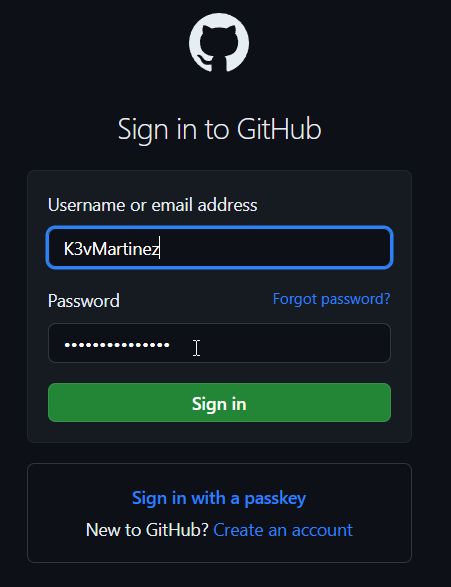

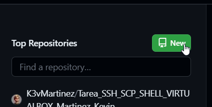

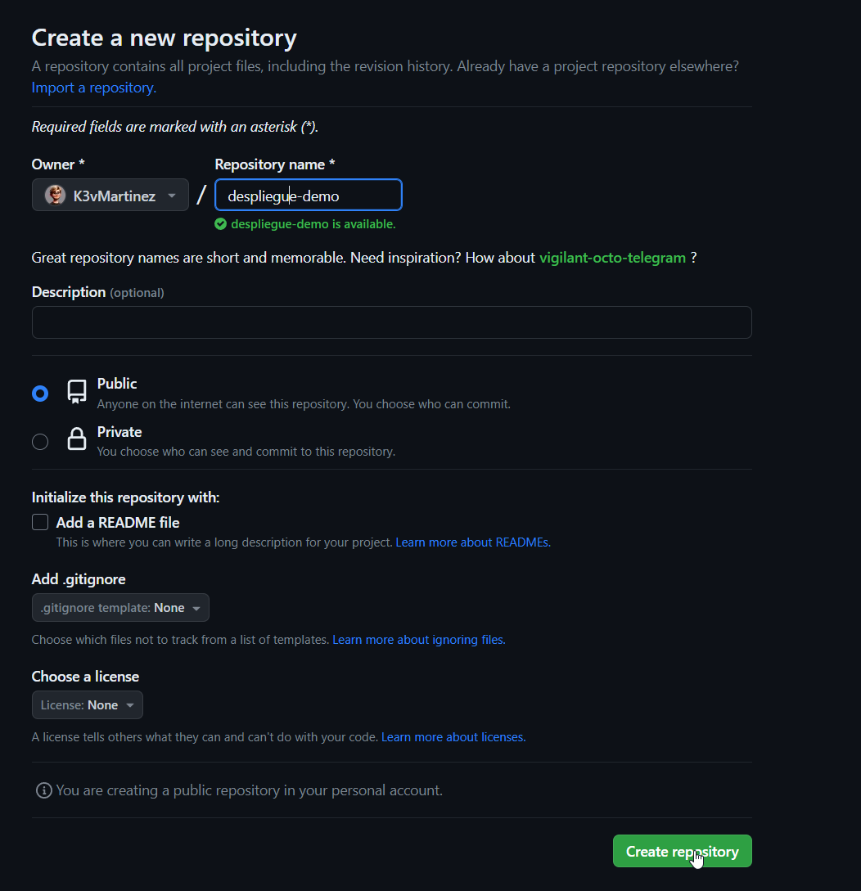

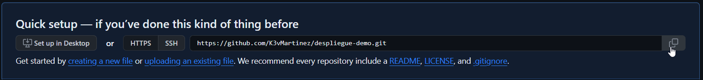


De vuelta a la terminal **git bash**, crea el remoto con el enlace copiado anteriormente. Puedes dejar la abreviación en **origin** o ponerle el nombre que quieras.

Vuelve a mostrar los repositorios remotos que tienes configurados.

```bash
Kevin@DESKTOP-TIUU4RP MINGW64 ~/DESKTOP/DESPLIEGUE/despliegue-demo (master)
$ git branch -M main

Kevin@DESKTOP-TIUU4RP MINGW64 ~/DESKTOP/DESPLIEGUE/despliegue-demo (main)
$ git remote add origin https://github.com/K3vMartinez/despliegue-demo.git

Kevin@DESKTOP-TIUU4RP MINGW64 ~/DESKTOP/DESPLIEGUE/despliegue-demo (main)
$ git push -u origin main
Enumerating objects: 19, done.
Counting objects: 100% (19/19), done.
Delta compression using up to 16 threads
Compressing objects: 100% (12/12), done.
Writing objects: 100% (19/19), 1.64 KiB | 280.00 KiB/s, done.
Total 19 (delta 3), reused 0 (delta 0), pack-reused 0
remote: Resolving deltas: 100% (3/3), done.
To https://github.com/K3vMartinez/despliegue-demo.git
 * [new branch]      main -> main
branch 'main' set up to track 'origin/main'.

Kevin@DESKTOP-TIUU4RP MINGW64 ~/DESKTOP/DESPLIEGUE/despliegue-demo (main)
$ git remote -v
origin  https://github.com/K3vMartinez/despliegue-demo.git (fetch)
origin  https://github.com/K3vMartinez/despliegue-demo.git (push)

Kevin@DESKTOP-TIUU4RP MINGW64 ~/DESKTOP/DESPLIEGUE/despliegue-demo (main)
$ git remote
origin

```

[OPCIONAL] Cambia la configuración del repositorio remoto para que se pueda acceder mediante claves ssh. Recuerda que tienes que tener una par de claves asimétricas y subir la clave pública a github para poder conectarte.

## 2.2.- Subir repositorio (push, .gitignore)
Vuelve a mostrar las ramas que tenemos en nuestro directorio.

Sube la rama principal al repositorio remoto que acabas de configurar. Al usar **https** te pedirá el usuario y la contraseña de github. Añade el parámetro **-u** para añadir la referencia al upstream.

> Si quisieramos subir todas las ramas a nuestro repositorio remoto podemos cambiar el nombre de la
rama main por el parámetro **--all**.

Vuelve a mostrar las ramas que tenemos. Deberá aparecer una nueva para el repositorio remoto.

```bash
Kevin@DESKTOP-TIUU4RP MINGW64 ~/DESKTOP/DESPLIEGUE/despliegue-demo (main)
$ git push -u origin main
Enumerating objects: 19, done.
Counting objects: 100% (19/19), done.
Delta compression using up to 16 threads
Compressing objects: 100% (12/12), done.
Writing objects: 100% (19/19), 1.64 KiB | 280.00 KiB/s, done.
Total 19 (delta 3), reused 0 (delta 0), pack-reused 0
remote: Resolving deltas: 100% (3/3), done.
To https://github.com/K3vMartinez/despliegue-demo.git
 * [new branch]      main -> main
branch 'main' set up to track 'origin/main'.

Kevin@DESKTOP-TIUU4RP MINGW64 ~/DESKTOP/DESPLIEGUE/despliegue-demo (main)
$ git remote -v
origin  https://github.com/K3vMartinez/despliegue-demo.git (fetch)
origin  https://github.com/K3vMartinez/despliegue-demo.git (push)

Kevin@DESKTOP-TIUU4RP MINGW64 ~/DESKTOP/DESPLIEGUE/despliegue-demo (main)
$ git remote
origin
```

Vamos a crear un archivo llamado **secreto.md** que no queremos que se suba a los repositorios remotos. Crea dicho archivo y usa un archivo **.gitignore** para evitar que esto suceda.

Modifica el archivo README.md y añade el nombre del módulo. Haz commit de este cambio y de los anteriores.

Sube estos cambios al repositorio remoto.

Comprueba en la web de github que se ha modificado el archivo README.md, se ha añadido el archivo .gitignore pero no el archivo secreto.md. Añade capturas de pantalla de este proceso.

```bash
Kevin@DESKTOP-TIUU4RP MINGW64 ~/DESKTOP/DESPLIEGUE/despliegue-demo (main)
$ echo 'secretos mios' > secreto.md

Kevin@DESKTOP-TIUU4RP MINGW64 ~/DESKTOP/DESPLIEGUE/despliegue-demo (main)
$ echo 'secreto.md' > .gitignore

Kevin@DESKTOP-TIUU4RP MINGW64 ~/DESKTOP/DESPLIEGUE/despliegue-demo (main)
$ nano README.md

Kevin@DESKTOP-TIUU4RP MINGW64 ~/DESKTOP/DESPLIEGUE/despliegue-demo (main)
$ git status
On branch main
Your branch is up to date with 'origin/main'.

Changes not staged for commit:
  (use "git add <file>..." to update what will be committed)
  (use "git restore <file>..." to discard changes in working directory)
        modified:   README.md

Untracked files:
  (use "git add <file>..." to include in what will be committed)
        .gitignore

no changes added to commit (use "git add" and/or "git commit -a")

Kevin@DESKTOP-TIUU4RP MINGW64 ~/DESKTOP/DESPLIEGUE/despliegue-demo (main)
$ git add README.md .gitignore
warning: in the working copy of '.gitignore', LF will be replaced by CRLF the next time Git touches it

Kevin@DESKTOP-TIUU4RP MINGW64 ~/DESKTOP/DESPLIEGUE/despliegue-demo (main)
$ git commit -m "Modifico README y aññado gitignore"
[main b37cb4a] Modifico README y aññado gitignore
 2 files changed, 2 insertions(+)
 create mode 100644 .gitignore

Kevin@DESKTOP-TIUU4RP MINGW64 ~/DESKTOP/DESPLIEGUE/despliegue-demo (main)
$ git push origin main
Enumerating objects: 6, done.
Counting objects: 100% (6/6), done.
Delta compression using up to 16 threads
Compressing objects: 100% (3/3), done.
Writing objects: 100% (4/4), 409 bytes | 204.00 KiB/s, done.
Total 4 (delta 0), reused 0 (delta 0), pack-reused 0
To https://github.com/K3vMartinez/despliegue-demo.git
   9def78f..b37cb4a  main -> main
```
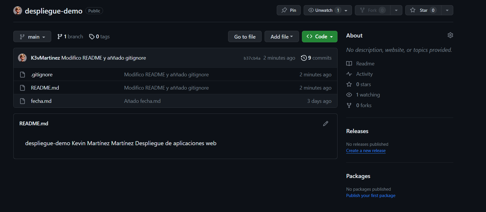


## 2.3.- Descargar repositorio (clone, fetch, pull)

Vamos a suponer que cambiamos de ordenador y queremos seguir trabajando en el repositorio que ya tenemos subido a github. Crea otra carpeta hermana de despliegue-demo que se llame **ordenador2** y descárgate todo el repositorio con **clone**.

Modifica el archivo el archivo README.md y deja solo el texto despliegue-demo. Realiza un commit y sube los cambios al repositorio remoto con **push**.

Muestra el registro de commit con todos los datos. Debe aparecer el nuevo commit.

```bash
Kevin@DESKTOP-TIUU4RP MINGW64 ~/DESKTOP/DESPLIEGUE/despliegue-demo (main)
$ cd ..

Kevin@DESKTOP-TIUU4RP MINGW64 ~/DESKTOP/DESPLIEGUE
$ mkdir ordenador2

Kevin@DESKTOP-TIUU4RP MINGW64 ~/DESKTOP/DESPLIEGUE
$ cd ordenador2/

Kevin@DESKTOP-TIUU4RP MINGW64 ~/DESKTOP/DESPLIEGUE/ordenador2
$ git clone https://github.com/K3vMartinez/despliegue-demo.git
Cloning into 'despliegue-demo'...
remote: Enumerating objects: 23, done.
remote: Counting objects: 100% (23/23), done.
remote: Compressing objects: 100% (12/12), done.
remote: Total 23 (delta 3), reused 23 (delta 3), pack-reused 0
Receiving objects: 100% (23/23), done.
Resolving deltas: 100% (3/3), done.

Kevin@DESKTOP-TIUU4RP MINGW64 ~/DESKTOP/DESPLIEGUE/ordenador2
$ cd despliegue-demo/

Kevin@DESKTOP-TIUU4RP MINGW64 ~/DESKTOP/DESPLIEGUE/ordenador2/despliegue-demo (main)
$ nano README.md

Kevin@DESKTOP-TIUU4RP MINGW64 ~/DESKTOP/DESPLIEGUE/ordenador2/despliegue-demo (main)
$ git add README.md

Kevin@DESKTOP-TIUU4RP MINGW64 ~/DESKTOP/DESPLIEGUE/ordenador2/despliegue-demo (main)
$ git commit -m "Modifico README.md quitando todo menos despliegue-demo"
[main 6984dcd] Modifico README.md quitando todo menos despliegue-demo
 1 file changed, 2 deletions(-)

Kevin@DESKTOP-TIUU4RP MINGW64 ~/DESKTOP/DESPLIEGUE/ordenador2/despliegue-demo (main)
$ git push
Enumerating objects: 5, done.
Counting objects: 100% (5/5), done.
Delta compression using up to 16 threads
Compressing objects: 100% (2/2), done.
Writing objects: 100% (3/3), 356 bytes | 356.00 KiB/s, done.
Total 3 (delta 0), reused 1 (delta 0), pack-reused 0
To https://github.com/K3vMartinez/despliegue-demo.git
   b37cb4a..6984dcd  main -> main

Kevin@DESKTOP-TIUU4RP MINGW64 ~/DESKTOP/DESPLIEGUE/ordenador2/despliegue-demo (main)
$ git log --oneline
6984dcd (HEAD -> main, origin/main, origin/HEAD) Modifico README.md quitando todo menos despliegue-demo
b37cb4a Modifico README y aññado gitignore
9def78f Merge branch 'rama-modificacion'
0e9dcf9 Añado fecha.md
26ce8f6 Agrego mi nombre
cf9f008 Revert "anñado centro.md"
8336ef3 anñado centro.md
e477ed9 Revert "anñado centro.md"
564c7ce anñado centro.md
626c594 Creo README
```

> Cuando trabajamos en equipo a veces queremos saber quién fue la última persona que modifico un archivo. Para ello podemos usar el comando **blame**, por ejemplo con: **git blame archivo.txt**.

Comprueba qué usuarios han modificado el archivo README.md con **blame**.

```bash
Kevin@DESKTOP-TIUU4RP MINGW64 ~/DESKTOP/DESPLIEGUE/ordenador2/despliegue-demo (main)
$ git blame README.md
^626c594 (Kevin 2023-11-16 09:40:33 +0100 1) despliegue-demo
```

Si volvieramos a seguir trabajando en el primer ordenador no veriamos estos cambios automaticamente. Cambia a la carpeta **despliegue-demo** original y muestra el registro de commit con todos los datos. No debe aparecer el nuevo commit.

Desde la carpeta original **despliegue-demo**, descarga las actualizaciones de cambios y que se apliquen en el directorio de trabajo con **pull**.

Vuelve a mostrar el registro de commit con todos los datos. Ya sí debe aparecer el nuevo commit.

```bash
Kevin@DESKTOP-TIUU4RP MINGW64 ~/DESKTOP/DESPLIEGUE/ordenador2/despliegue-demo (main)
$ cd ..

Kevin@DESKTOP-TIUU4RP MINGW64 ~/DESKTOP/DESPLIEGUE/ordenador2
$ cd ..

Kevin@DESKTOP-TIUU4RP MINGW64 ~/DESKTOP/DESPLIEGUE
$ cd despliegue-demo/

Kevin@DESKTOP-TIUU4RP MINGW64 ~/DESKTOP/DESPLIEGUE/despliegue-demo (main)
$ git log --oneline
b37cb4a (HEAD -> main, origin/main) Modifico README y aññado gitignore
9def78f Merge branch 'rama-modificacion'
0e9dcf9 Añado fecha.md
26ce8f6 Agrego mi nombre
cf9f008 (tag: v2.1) Revert "anñado centro.md"
8336ef3 (tag: v2.0) anñado centro.md
e477ed9 Revert "anñado centro.md"
564c7ce anñado centro.md
626c594 Creo README


Kevin@DESKTOP-TIUU4RP MINGW64 ~/DESKTOP/DESPLIEGUE/despliegue-demo (main)
$ git pull
remote: Enumerating objects: 5, done.
remote: Counting objects: 100% (5/5), done.
remote: Compressing objects: 100% (2/2), done.
remote: Total 3 (delta 0), reused 3 (delta 0), pack-reused 0
Unpacking objects: 100% (3/3), 336 bytes | 84.00 KiB/s, done.
From https://github.com/K3vMartinez/despliegue-demo
   b37cb4a..6984dcd  main       -> origin/main
Updating b37cb4a..6984dcd
Fast-forward
 README.md | 2 --
 1 file changed, 2 deletions(-)

Kevin@DESKTOP-TIUU4RP MINGW64 ~/DESKTOP/DESPLIEGUE/despliegue-demo (main)
$ git log --oneline
6984dcd (HEAD -> main, origin/main) Modifico README.md quitando todo menos despliegue-demo
b37cb4a Modifico README y aññado gitignore
9def78f Merge branch 'rama-modificacion'
0e9dcf9 Añado fecha.md
26ce8f6 Agrego mi nombre
cf9f008 (tag: v2.1) Revert "anñado centro.md"
8336ef3 (tag: v2.0) anñado centro.md
e477ed9 Revert "anñado centro.md"
564c7ce anñado centro.md
626c594 Creo README

```

Existe otra opción para descargarnos las actualizaciones del repositorio remoto pero que estas no se cargen directamente en nuestro repositorio principal local sino que se queden en el repositorio remotes/origin/main. Desde la carpeta original **despliegue-demo**, vuelve a modificar el archivo el archivo README.md y añade el texto 'hola'. Realiza un commit y sube los cambios al repositorio remoto con **push**.

```bash
Kevin@DESKTOP-TIUU4RP MINGW64 ~/DESKTOP/DESPLIEGUE/despliegue-demo (main)
$ nano README.md

Kevin@DESKTOP-TIUU4RP MINGW64 ~/DESKTOP/DESPLIEGUE/despliegue-demo (main)
$ git commit -am "Añado 'hola' al README.md"
[main 2839af5] Añado 'hola' al README.md
 1 file changed, 1 insertion(+)

Kevin@DESKTOP-TIUU4RP MINGW64 ~/DESKTOP/DESPLIEGUE/despliegue-demo (main)
$ git push
Enumerating objects: 5, done.
Counting objects: 100% (5/5), done.
Delta compression using up to 16 threads
Compressing objects: 100% (2/2), done.
Writing objects: 100% (3/3), 344 bytes | 114.00 KiB/s, done.
Total 3 (delta 0), reused 0 (delta 0), pack-reused 0
To https://github.com/K3vMartinez/despliegue-demo.git
   6984dcd..2839af5  main -> main
```

Vamos a simular que volvemos a cambiar al **ordenador2**. Cambia de directorio y accede al repositorio.

Muestra todas las ramas incluyendo las remotas. Nos aparecera una tercera rama **remotes/origin/HEAD** que nos indica cuál es la rama principal del repositorio remoto.

Muestra el estado de git. Aunque hemos realizado un cambio y subido a Github este no aparece en el estado de git de forma automática.

```bash
Kevin@DESKTOP-TIUU4RP MINGW64 ~/DESKTOP/DESPLIEGUE/despliegue-demo (main)
$ cd ..

Kevin@DESKTOP-TIUU4RP MINGW64 ~/DESKTOP/DESPLIEGUE
$ cd ordenador2/despliegue-demo/

Kevin@DESKTOP-TIUU4RP MINGW64 ~/DESKTOP/DESPLIEGUE/ordenador2/despliegue-demo (main)
$ git branch --all
* main
  remotes/origin/HEAD -> origin/main
  remotes/origin/main

Kevin@DESKTOP-TIUU4RP MINGW64 ~/DESKTOP/DESPLIEGUE/ordenador2/despliegue-demo (main)
$ git status
On branch main
Your branch is up to date with 'origin/main'.

nothing to commit, working tree clean
```

Descarga las actualizaciones de cambios pero que no se apliquen en el directorio de trabajo con **fetch**.

Muestra el contenido del archivo **README.md**. Aún no debe aparecer el último texto que añadimos en en otro ordenador. Ya que lo descargamos a la rama **origin/main** y no a la **main** que es donde estamos trabajando.

Vuelve a mostrar el estado de git. Ahora sí que nos avisa de que nuestra rama principal **main** está desactualizada respecto a de la rama **origin/main** que nos acabamos de descargar.

```bash
Kevin@DESKTOP-TIUU4RP MINGW64 ~/DESKTOP/DESPLIEGUE/ordenador2/despliegue-demo (main)
$ git fetch
remote: Enumerating objects: 5, done.
remote: Counting objects: 100% (5/5), done.
remote: Compressing objects: 100% (2/2), done.
remote: Total 3 (delta 0), reused 3 (delta 0), pack-reused 0
Unpacking objects: 100% (3/3), 324 bytes | 29.00 KiB/s, done.
From https://github.com/K3vMartinez/despliegue-demo
   6984dcd..2839af5  main       -> origin/main

Kevin@DESKTOP-TIUU4RP MINGW64 ~/DESKTOP/DESPLIEGUE/ordenador2/despliegue-demo (main)
$ cat README.md
despliegue-demo

Kevin@DESKTOP-TIUU4RP MINGW64 ~/DESKTOP/DESPLIEGUE/ordenador2/despliegue-demo (main)
$ git status
On branch main
Your branch is behind 'origin/main' by 1 commit, and can be fast-forwarded.
  (use "git pull" to update your local branch)

nothing to commit, working tree clean
```

En lugar de hacer la sugerencia que nos indica **git status**:**git pull** para actualizar a la última versión de nuestro repositorio remoto, vamos a crear una divergencia de las ramas. Desde la carpeta **ordenador2/despliegue-demo**, crea un nuevo archivo llamado **saludo.md**. Haz un commit local pero no lo subas al repositorio remoto.

Muestra el registro de commit con toda la información. Se deben ver líneas de ramas separadas.

```bash
Kevin@DESKTOP-TIUU4RP MINGW64 ~/DESKTOP/DESPLIEGUE/ordenador2/despliegue-demo (main)
$ echo "hola amigos" > saludo.md

Kevin@DESKTOP-TIUU4RP MINGW64 ~/DESKTOP/DESPLIEGUE/ordenador2/despliegue-demo (main)
$ git add saludo.md
warning: in the working copy of 'saludo.md', LF will be replaced by CRLF the next time Git touches it

Kevin@DESKTOP-TIUU4RP MINGW64 ~/DESKTOP/DESPLIEGUE/ordenador2/despliegue-demo (main)
$ git commit -m "Añado saludo.md"
[main 98b771e] Añado saludo.md
 1 file changed, 1 insertion(+)
 create mode 100644 saludo.md

Kevin@DESKTOP-TIUU4RP MINGW64 ~/DESKTOP/DESPLIEGUE/ordenador2/despliegue-demo (main)
$ git log --oneline --decorate --all --graph
* 98b771e (HEAD -> main) Añado saludo.md
| * 2839af5 (origin/main, origin/HEAD) Añado 'hola' al README.md
|/
* 6984dcd Modifico README.md quitando todo menos despliegue-demo
* b37cb4a Modifico README y aññado gitignore
*   9def78f Merge branch 'rama-modificacion'
|\
| * 26ce8f6 Agrego mi nombre
* | 0e9dcf9 Añado fecha.md
|/
* cf9f008 Revert "anñado centro.md"
* 8336ef3 anñado centro.md
* e477ed9 Revert "anñado centro.md"
* 564c7ce anñado centro.md
* 626c594 Creo README
```

Intenta actualizar el repositorio local con el comando **pull**. Debe darte un aviso de divergencia de ramas y no hacer el **pull**.
```bash
Kevin@DESKTOP-TIUU4RP MINGW64 ~/DESKTOP/DESPLIEGUE/ordenador2/despliegue-demo (main)
$ git pull
Merge made by the 'ort' strategy.
 README.md | 1 +
 1 file changed, 1 insertion(+)

Merge branch 'main' of https://github.com/K3vMartinez/despliegue-demo
# Please enter a commit message to explain why this merge is necessary,
# especially if it merges an updated upstream into a topic branch.
#
# Lines starting with '#' will be ignored, and an empty message aborts
# the commit.
~
~
~
~
~
~
~
.git/MERGE_MSG [unix] (18:47 29/11/2023)                                                1,1 All
"~/Desktop/DESPLIEGUE/ordenador2/despliegue-demo/.git/MERGE_MSG" [unix] 6L, 296B

```

Esta advertencia es debido a que si ejecutamos el **pull**, actualizaremos los archivos con los que tenemos en nuestro remoto y el trabajo local se podría perder. En este caso, en lugar de hacer un **pull** vamos a realizar una fusión **merge** en la rama **main** con la rama **origin/main**. Como para realizar la fusión necesita crear un nuevo commit te pedirá que pongas un mensaje de commit o dejes el que te proponen.

Vuelve a mostrar el registro de commit con todos los datos. Ya sí debe aparecer las líneas de las ramas que vuelven a unirse.
```bash
Kevin@DESKTOP-TIUU4RP MINGW64 ~/DESKTOP/DESPLIEGUE/ordenador2/despliegue-demo (main)
$ git pull
Merge made by the 'ort' strategy.
 README.md | 1 +
 1 file changed, 1 insertion(+)

Kevin@DESKTOP-TIUU4RP MINGW64 ~/DESKTOP/DESPLIEGUE/ordenador2/despliegue-demo (main)
$ git log --oneline --decorate --all --graph
*   2ffefa6 (HEAD -> main) Merge branch 'main' of https://github.com/K3vMartinez/despliegue-demo
|\
| * 2839af5 (origin/main, origin/HEAD) Añado 'hola' al README.md
* | 98b771e Añado saludo.md
|/
* 6984dcd Modifico README.md quitando todo menos despliegue-demo
* b37cb4a Modifico README y aññado gitignore
*   9def78f Merge branch 'rama-modificacion'
|\
| * 26ce8f6 Agrego mi nombre
* | 0e9dcf9 Añado fecha.md
|/
* cf9f008 Revert "anñado centro.md"
* 8336ef3 anñado centro.md
* e477ed9 Revert "anñado centro.md"
* 564c7ce anñado centro.md
* 626c594 Creo README

Kevin@DESKTOP-TIUU4RP MINGW64 ~/DESKTOP/DESPLIEGUE/ordenador2/despliegue-demo (main)
$ git status
On branch main
Your branch is ahead of 'origin/main' by 2 commits.
  (use "git push" to publish your local commits)

nothing to commit, working tree clean

```

# 3.- Markdown

Crea una tabla resumen de los comandos de git. La tabla tendrá tres columnas: la primera con el comando, la segunda con una explicación y la tercera con un ejemplo.

## Resumen de comandos git

Comando | Función | Ejemplo
--------|---------|---------
init | Inicia un repositorio | git init
config | Para configurar los datos del git | git config --global user.name "Tu Nombre"
add | Para añadir al stage un archivo/directorio | git add README.md
commit | Para añadir al repositorio un archivo o directorio | git commit -m "Añado README.md"
status | Para saber en qué estado está nuestro git | git status 
log | Para ver el historial de commits realizados | git log --oneline 
diff | Para ver la diferencia entre un commit y otro | git diff (commit1) (commit2)
show | Para mostrar información sobre el objeto que estás consultando | git show (nombre etiqueta)
tag | Para crear etiquetas | git tag v1.0.0
restore | Para restaurar archivos en tu directorio de trabajo | git restore archivo.txt
revert | Para deshacer cambios realizados en una confirmación específica | git revert HEAD
reset | Para deshacer cambios en el historial de confirmaciones | git reset --soft HEAD~1
branch | Para crear una rama o para ver qué ramas tenemos en git | git branch (nueva rama)
switch | Para cambiar de una rama a otra | git switch main
merge | Para fusionar dos ramas | git merge (rama)
remote | Para administrar conexiones remotas a repositorios | git remote show origin
clone | Para clonar un repositorio remoto y crear una copia local de ese repositorio en tu máquina | git clone (URL)
push | Para enviar los cambios locales realizados en tu rama a un repositorio remoto | git push origin main
pull | Para recuperar cambios desde un repositorio remoto y fusionarlos automáticamente en tu rama local | git pull origin main
fetch | Para descargar cambios desde un repositorio remoto | git fetch origin main

# 4.- Uso de Git, Github y Markdown en Visual Studio Code.
                                                          
Desde VSCode, crea una nueva rama con el formato **rama-TuNombre**.

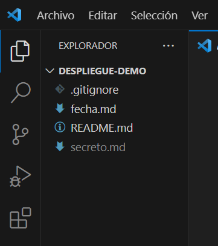

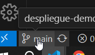

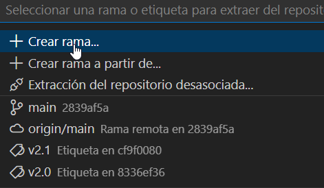

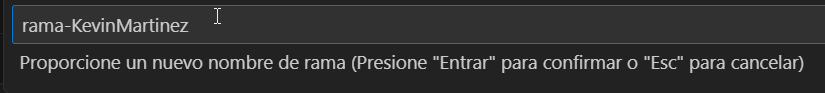


Crea un archivo llamado **resumen.md** con un título y la tabla hecha en el apartado anterior.

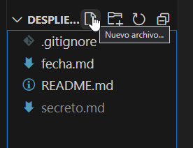

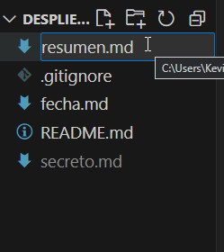

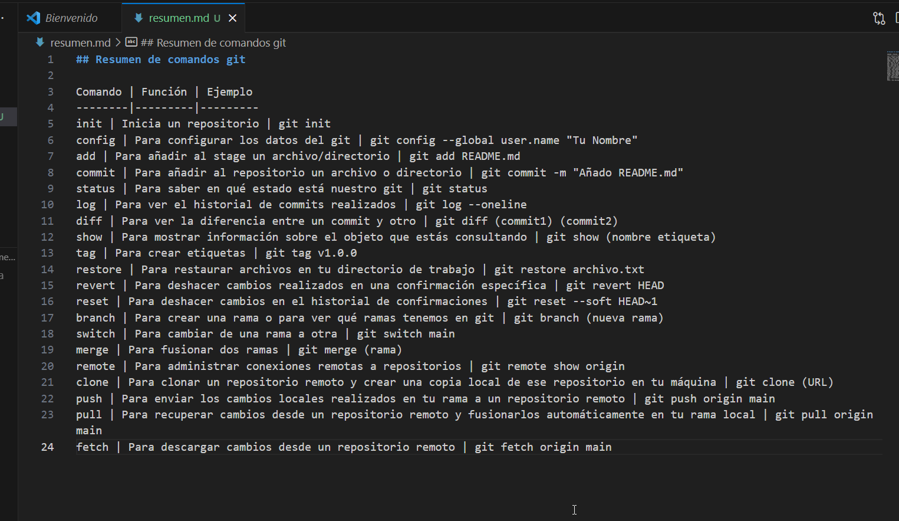

Muestra la vista previa de markdown en VSCode.

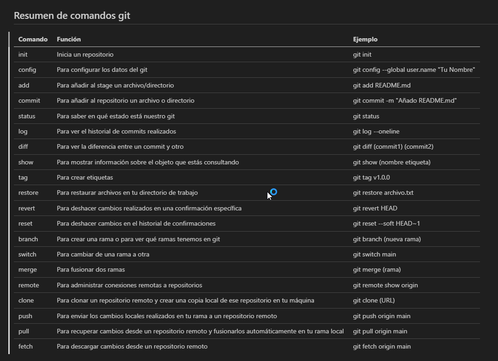


Desde VSCode, añade y haz commit del archivo **resumen.md** de la rama-TuNombre. Súbelo al repositorio
remoto de Github.

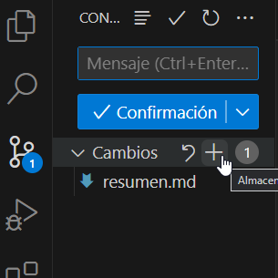

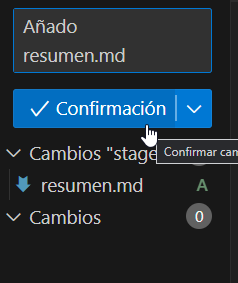

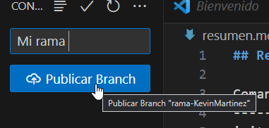

Muestra en Github que se ha subido la nueva **rama-TuNombre** y que contienen en nuevo archivo
**resumen.md**.

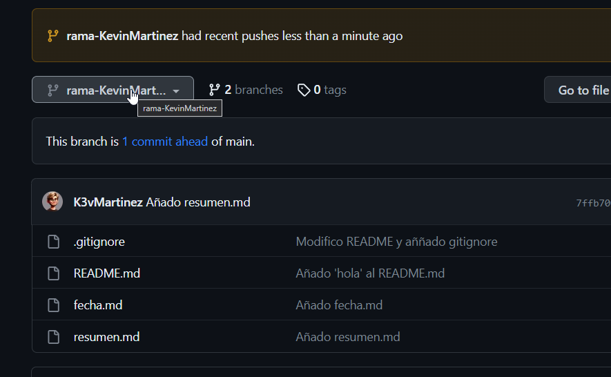


Muestra en Github también la rama **main** que aún no tienen el archivo **resumen.md**.

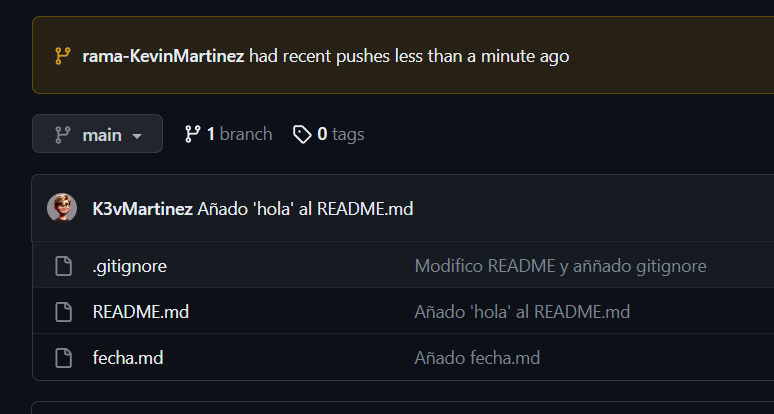
